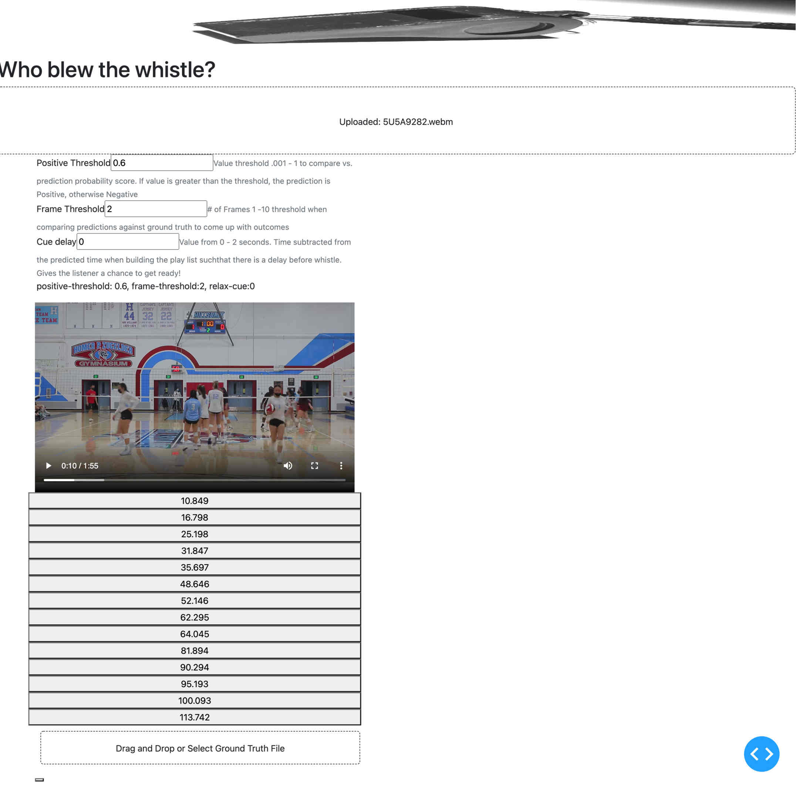
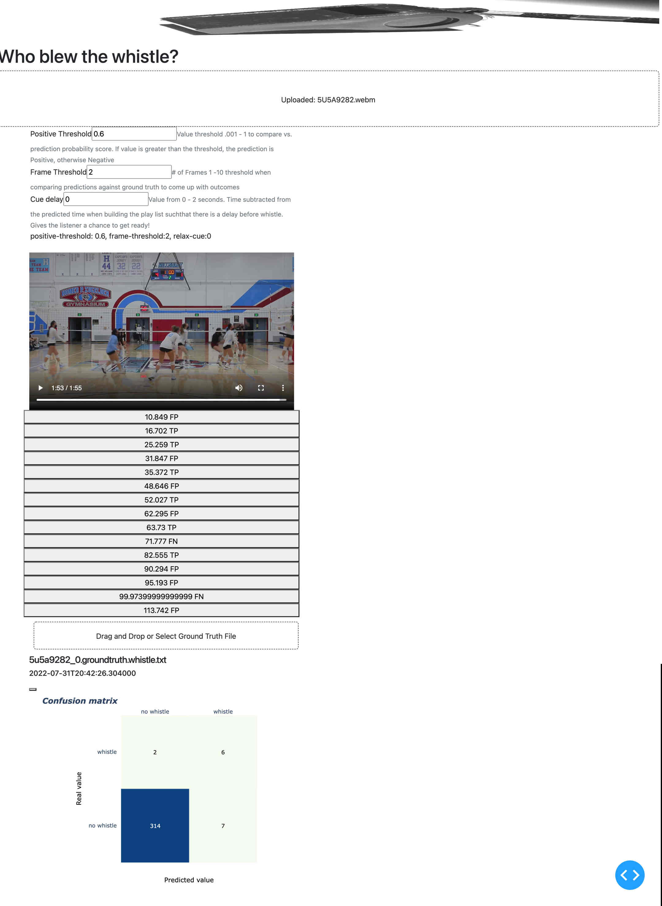

The following image shows the webapp once a video is uploaded

A second operation after uploading video, is to upload a ground truth  file denoting the times in seconds
when a whistle was blown.  This will show the outcome for each prediction.  Note how the cue marks have added
text with FP, TP, FN.  

Also note the confusino matrix results

References

Audio processing.  Signal to Sliding Frames.  FFT  Filter   https://librosa.org/doc/latest/index.html

https://towardsdatascience.com/make-your-own-video-editor-app-with-python-dash-moviepy-f0dd57c2b68e

https://developer.mozilla.org/en-US/docs/Web/HTML/Element/video

https://github.com/plotly/dash-player

https://github.com/shkiefer/dash_large_files#readme

https://dash-bootstrap-components.opensource.faculty.ai/docs/components/form/

ISSUES

Can't get it running in Sagemaker Labs Environment.

Problem 1 PyGObject cannot install;  commentted that out but ran into Problem 2 running app.py

ERROR: Command errored out with exit status 1:
command: /home/studio-lab-user/.conda/envs/studiolab/bin/python3.9 /tmp/pip-standalone-pip-0f9_bssr/__env_pip__.zip/pip install --ignore-installed --no-user --prefix /tmp/pip-build-env-q4bp3lwc/overlay --no-warn-script-location --no-binary :none: --only-binary :none: -i https://pypi.org/simple -- setuptools wheel pycairo
cwd: None
Complete output (35 lines):
Collecting setuptools
Using cached setuptools-63.4.0-py3-none-any.whl (1.2 MB)
Collecting wheel
Using cached wheel-0.37.1-py2.py3-none-any.whl (35 kB)
Collecting pycairo
Using cached pycairo-1.21.0.tar.gz (340 kB)
Installing build dependencies: started
Installing build dependencies: finished with status 'done'
Getting requirements to build wheel: started
Getting requirements to build wheel: finished with status 'done'
Preparing wheel metadata: started
Preparing wheel metadata: finished with status 'done'
Building wheels for collected packages: pycairo
Building wheel for pycairo (PEP 517): started
Building wheel for pycairo (PEP 517): finished with status 'error'
ERROR: Command errored out with exit status 1:
command: /home/studio-lab-user/.conda/envs/studiolab/bin/python3.9 /tmp/tmpq5g3xcoe_in_process.py build_wheel /tmp/tmpg5g34dol
cwd: /tmp/pip-install-gb1n2mop/pycairo_53948eea401a4414a74143a05bedc5e0
Complete output (12 lines):
running bdist_wheel
running build
running build_py
creating build
creating build/lib.linux-x86_64-cpython-39
creating build/lib.linux-x86_64-cpython-39/cairo
copying cairo/__init__.py -> build/lib.linux-x86_64-cpython-39/cairo
copying cairo/__init__.pyi -> build/lib.linux-x86_64-cpython-39/cairo
copying cairo/py.typed -> build/lib.linux-x86_64-cpython-39/cairo
running build_ext
'pkg-config' not found.
Command ['pkg-config', '--print-errors', '--exists', 'cairo >= 1.15.10']
----------------------------------------
ERROR: Failed building wheel for pycairo
Failed to build pycairo
ERROR: Could not build wheels for pycairo which use PEP 517 and cannot be installed directly
  ----------------------------------------
WARNING: Discarding https://files.pythonhosted.org/packages/41/d0/7eaebdca0723b267b96a8b7de2743cc223fbb47f651346b3e9b768acf8dd/PyGObject-3.42.1.tar.gz#sha256=80d6a3ad1630e9d1edf31b9e9fad9a894c57e18545a3c95ef0044ac4042b8620 (from https://pypi.org/simple/pygobject/) (requires-python:>=3.6, <4). Command errored out with exit status 1: /home/studio-lab-user/.conda/envs/studiolab/bin/python3.9 /tmp/pip-standalone-pip-0f9_bssr/__env_pip__.zip/pip install --ignore-installed --no-user --prefix /tmp/pip-build-env-q4bp3lwc/overlay --no-warn-script-location --no-binary :none: --only-binary :none: -i https://pypi.org/simple -- setuptools wheel pycairo Check the logs for full command output.
ERROR: Could not find a version that satisfies the requirement PyGObject==3.42.1 (from versions: 3.27.0, 3.27.1, 3.27.2, 3.27.3, 3.27.4, 3.27.5, 3.28.0, 3.28.1, 3.28.2, 3.28.3, 3.29.1.dev0, 3.29.2.dev0, 3.29.3.dev0, 3.30.0, 3.30.1, 3.30.2, 3.30.3, 3.30.4, 3.30.5, 3.31.1.dev0, 3.31.2.dev0, 3.31.3.dev0, 3.31.4.dev0, 3.32.0, 3.32.1, 3.32.2, 3.33.1.dev0, 3.34.0, 3.36.0, 3.36.1, 3.38.0, 3.40.0, 3.40.1, 3.42.0, 3.42.1, 3.42.2)
ERROR: No matching distribution found for PyGObject==3.42.1

==================================================== PROBLEM 2 ========================================

2022-08-03 08:34:04.609951: I tensorflow/stream_executor/cuda/cudart_stub.cc:29] Ignore above cudart dlerror if you do not have a GPU set up on your machine.
Traceback (most recent call last):
File "/home/studio-lab-user/intuit-ga-dat15/projects/whistlizer/app.py", line 20, in <module>
from util import smooth_confusion_matrix2, smooth_join2
File "/home/studio-lab-user/intuit-ga-dat15/projects/whistlizer/util.py", line 8, in <module>
import librosa
File "/home/studio-lab-user/.conda/envs/studiolab/lib/python3.9/site-packages/librosa/__init__.py", line 209, in <module>
from . import core
File "/home/studio-lab-user/.conda/envs/studiolab/lib/python3.9/site-packages/librosa/core/__init__.py", line 6, in <module>
from .audio import *  # pylint: disable=wildcard-import
File "/home/studio-lab-user/.conda/envs/studiolab/lib/python3.9/site-packages/librosa/core/audio.py", line 8, in <module>
import soundfile as sf
File "/home/studio-lab-user/.conda/envs/studiolab/lib/python3.9/site-packages/soundfile.py", line 142, in <module>
raise OSError('sndfile library not found')
OSError: sndfile library not found
(studiolab) studio-lab-user@default:~/intuit-ga-dat15/projects/whistlizer$ pip install sndfile
Collecting sndfile
Downloading sndfile-0.2.0.tar.gz (4.3 kB)
Requirement already satisfied: cffi>=1.0.0 in /home/studio-lab-user/.conda/envs/studiolab/lib/python3.9/site-packages (from sndfile) (1.15.1)
Requirement already satisfied: pycparser in /home/studio-lab-user/.conda/envs/studiolab/lib/python3.9/site-packages (from cffi>=1.0.0->sndfile) (2.21)
Building wheels for collected packages: sndfile
Building wheel for sndfile (setup.py) ... error
ERROR: Command errored out with exit status 1:
command: /home/studio-lab-user/.conda/envs/studiolab/bin/python3.9 -u -c 'import io, os, sys, setuptools, tokenize; sys.argv[0] = '"'"'/tmp/pip-install-jp5rnrup/sndfile_d1d725947fdb42fe8f25818228ca23e9/setup.py'"'"'; __file__='"'"'/tmp/pip-install-jp5rnrup/sndfile_d1d725947fdb42fe8f25818228ca23e9/setup.py'"'"';f = getattr(tokenize, '"'"'open'"'"', open)(__file__) if os.path.exists(__file__) else io.StringIO('"'"'from setuptools import setup; setup()'"'"');code = f.read().replace('"'"'\r\n'"'"', '"'"'\n'"'"');f.close();exec(compile(code, __file__, '"'"'exec'"'"'))' bdist_wheel -d /tmp/pip-wheel-muod41da
cwd: /tmp/pip-install-jp5rnrup/sndfile_d1d725947fdb42fe8f25818228ca23e9/
Complete output (23 lines):
running bdist_wheel
running build
running build_py
creating build
creating build/lib.linux-x86_64-3.9
creating build/lib.linux-x86_64-3.9/sndfile
copying sndfile/__init__.py -> build/lib.linux-x86_64-3.9/sndfile
copying sndfile/build.py -> build/lib.linux-x86_64-3.9/sndfile
copying sndfile/formats.py -> build/lib.linux-x86_64-3.9/sndfile
copying sndfile/io.py -> build/lib.linux-x86_64-3.9/sndfile
copying sndfile/vio.py -> build/lib.linux-x86_64-3.9/sndfile
running build_ext
generating cffi module 'build/temp.linux-x86_64-3.9/sndfile._sndfile.c'
creating build/temp.linux-x86_64-3.9
building 'sndfile._sndfile' extension
creating build/temp.linux-x86_64-3.9/build
creating build/temp.linux-x86_64-3.9/build/temp.linux-x86_64-3.9
gcc -pthread -B /home/studio-lab-user/.conda/envs/studiolab/compiler_compat -Wno-unused-result -Wsign-compare -DNDEBUG -fwrapv -O2 -Wall -fPIC -O2 -isystem /home/studio-lab-user/.conda/envs/studiolab/include -fPIC -O2 -isystem /home/studio-lab-user/.conda/envs/studiolab/include -fPIC -I/home/studio-lab-user/.conda/envs/studiolab/include/python3.9 -c build/temp.linux-x86_64-3.9/sndfile._sndfile.c -o build/temp.linux-x86_64-3.9/build/temp.linux-x86_64-3.9/sndfile._sndfile.o
build/temp.linux-x86_64-3.9/sndfile._sndfile.c:571:10: fatal error: sndfile.h: No such file or directory
571 | #include <sndfile.h>
|          ^~~~~~~~~~~
compilation terminated.
error: command '/usr/bin/gcc' failed with exit code 1
  ----------------------------------------
ERROR: Failed building wheel for sndfile
Running setup.py clean for sndfile
Failed to build sndfile
Installing collected packages: sndfile
Running setup.py install for sndfile ... error
ERROR: Command errored out with exit status 1:
command: /home/studio-lab-user/.conda/envs/studiolab/bin/python3.9 -u -c 'import io, os, sys, setuptools, tokenize; sys.argv[0] = '"'"'/tmp/pip-install-jp5rnrup/sndfile_d1d725947fdb42fe8f25818228ca23e9/setup.py'"'"'; __file__='"'"'/tmp/pip-install-jp5rnrup/sndfile_d1d725947fdb42fe8f25818228ca23e9/setup.py'"'"';f = getattr(tokenize, '"'"'open'"'"', open)(__file__) if os.path.exists(__file__) else io.StringIO('"'"'from setuptools import setup; setup()'"'"');code = f.read().replace('"'"'\r\n'"'"', '"'"'\n'"'"');f.close();exec(compile(code, __file__, '"'"'exec'"'"'))' install --record /tmp/pip-record-1dfijoyu/install-record.txt --single-version-externally-managed --compile --install-headers /home/studio-lab-user/.conda/envs/studiolab/include/python3.9/sndfile
cwd: /tmp/pip-install-jp5rnrup/sndfile_d1d725947fdb42fe8f25818228ca23e9/
Complete output (25 lines):
running install
/home/studio-lab-user/.conda/envs/studiolab/lib/python3.9/site-packages/setuptools/command/install.py:34: SetuptoolsDeprecationWarning: setup.py install is deprecated. Use build and pip and other standards-based tools.
warnings.warn(
running build
running build_py
creating build
creating build/lib.linux-x86_64-3.9
creating build/lib.linux-x86_64-3.9/sndfile
copying sndfile/__init__.py -> build/lib.linux-x86_64-3.9/sndfile
copying sndfile/build.py -> build/lib.linux-x86_64-3.9/sndfile
copying sndfile/formats.py -> build/lib.linux-x86_64-3.9/sndfile
copying sndfile/io.py -> build/lib.linux-x86_64-3.9/sndfile
copying sndfile/vio.py -> build/lib.linux-x86_64-3.9/sndfile
running build_ext
generating cffi module 'build/temp.linux-x86_64-3.9/sndfile._sndfile.c'
creating build/temp.linux-x86_64-3.9
building 'sndfile._sndfile' extension
creating build/temp.linux-x86_64-3.9/build
creating build/temp.linux-x86_64-3.9/build/temp.linux-x86_64-3.9
gcc -pthread -B /home/studio-lab-user/.conda/envs/studiolab/compiler_compat -Wno-unused-result -Wsign-compare -DNDEBUG -fwrapv -O2 -Wall -fPIC -O2 -isystem /home/studio-lab-user/.conda/envs/studiolab/include -fPIC -O2 -isystem /home/studio-lab-user/.conda/envs/studiolab/include -fPIC -I/home/studio-lab-user/.conda/envs/studiolab/include/python3.9 -c build/temp.linux-x86_64-3.9/sndfile._sndfile.c -o build/temp.linux-x86_64-3.9/build/temp.linux-x86_64-3.9/sndfile._sndfile.o
build/temp.linux-x86_64-3.9/sndfile._sndfile.c:571:10: fatal error: sndfile.h: No such file or directory
571 | #include <sndfile.h>
|          ^~~~~~~~~~~
compilation terminated.
error: command '/usr/bin/gcc' failed with exit code 1
----------------------------------------
ERROR: Command errored out with exit status 1: /home/studio-lab-user/.conda/envs/studiolab/bin/python3.9 -u -c 'import io, os, sys, setuptools, tokenize; sys.argv[0] = '"'"'/tmp/pip-install-jp5rnrup/sndfile_d1d725947fdb42fe8f25818228ca23e9/setup.py'"'"'; __file__='"'"'/tmp/pip-install-jp5rnrup/sndfile_d1d725947fdb42fe8f25818228ca23e9/setup.py'"'"';f = getattr(tokenize, '"'"'open'"'"', open)(__file__) if os.path.exists(__file__) else io.StringIO('"'"'from setuptools import setup; setup()'"'"');code = f.read().replace('"'"'\r\n'"'"', '"'"'\n'"'"');f.close();exec(compile(code, __file__, '"'"'exec'"'"'))' install --record /tmp/pip-record-1dfijoyu/install-record.txt --single-version-externally-managed --compile --install-headers /home/studio-lab-user/.conda/envs/studiolab/include/python3.9/sndfile Check the logs for full command output.
(studiolab) studio-lab-user@default:~/intuit-ga-dat15/projects/whistlizer$ 

